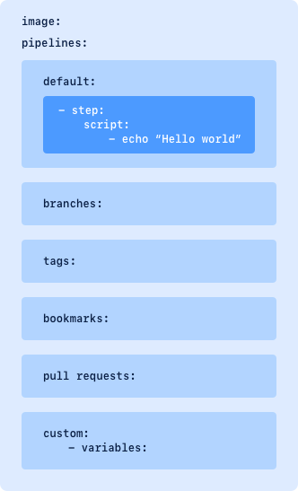
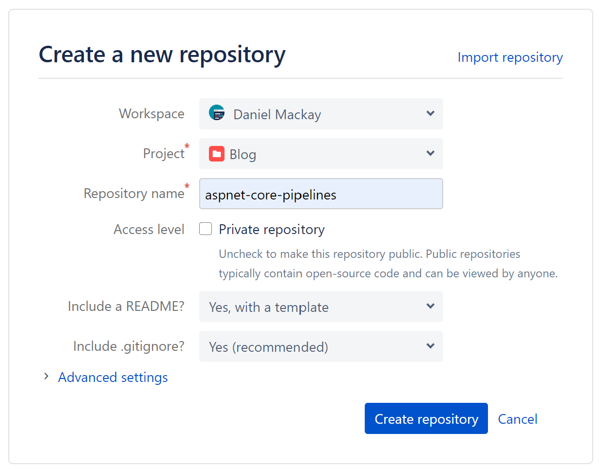
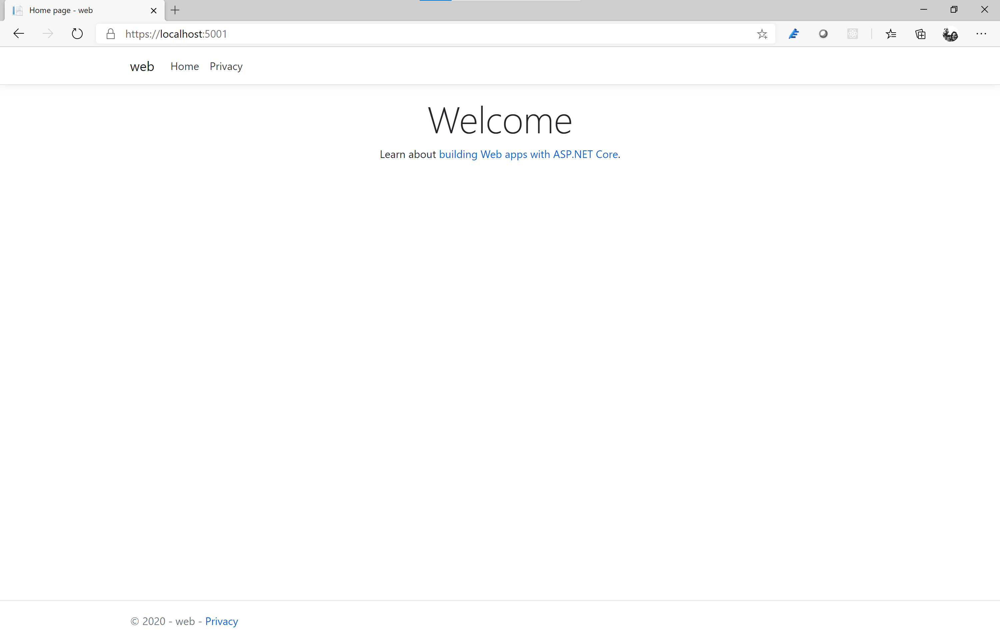
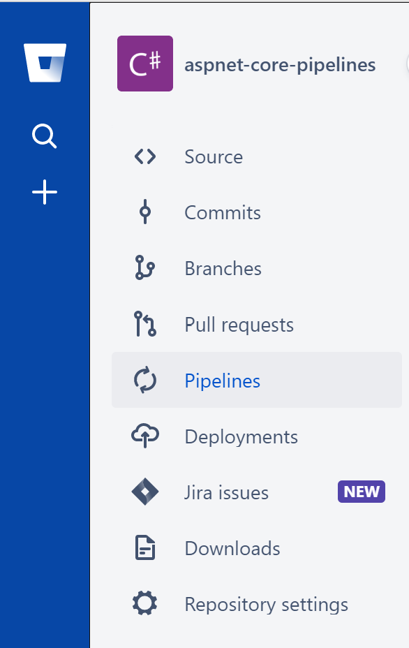
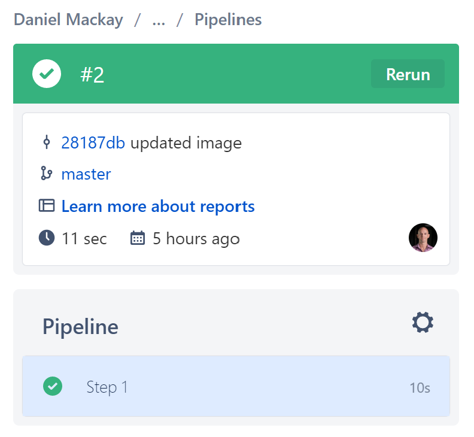
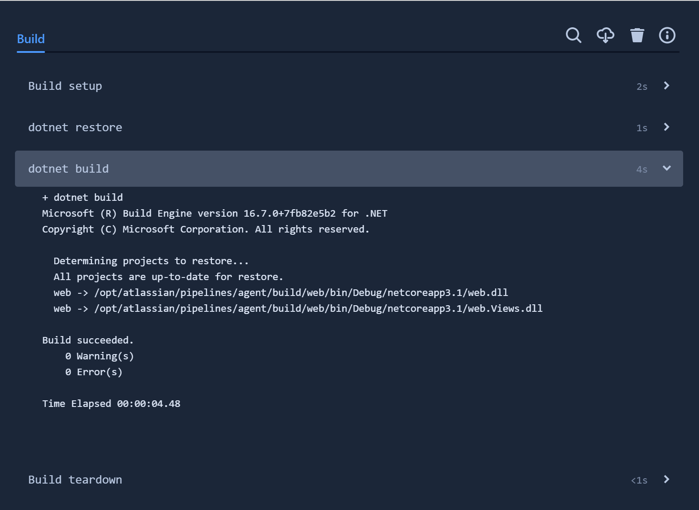
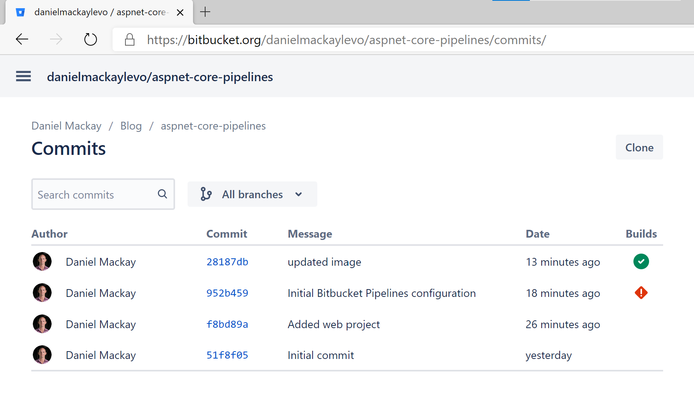
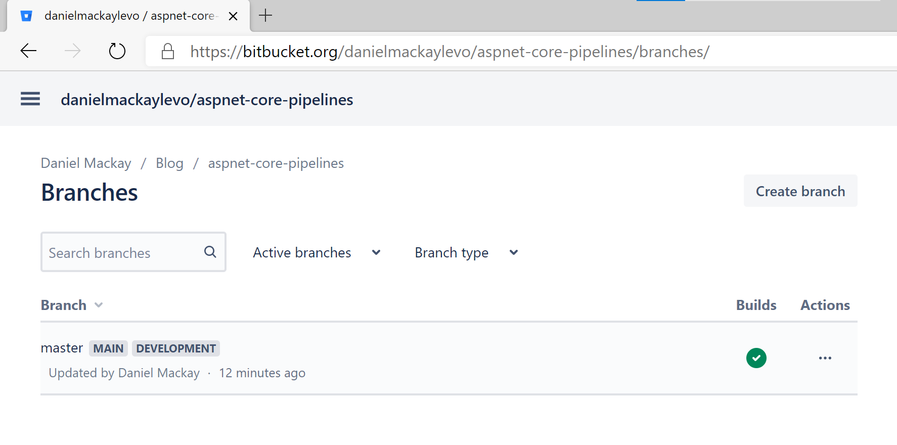
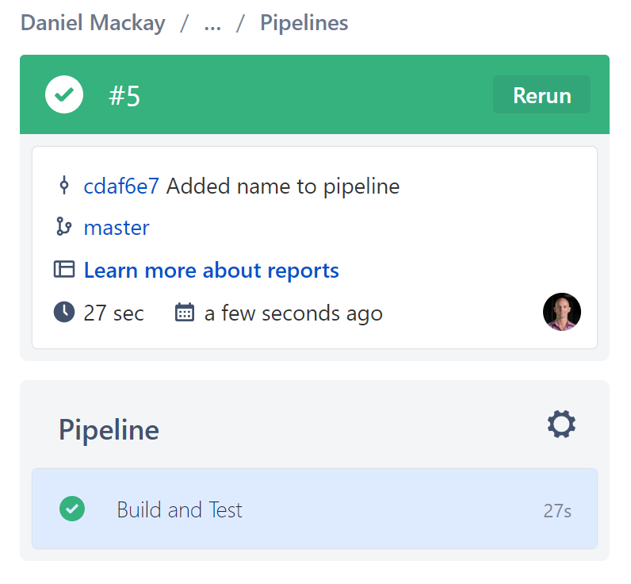
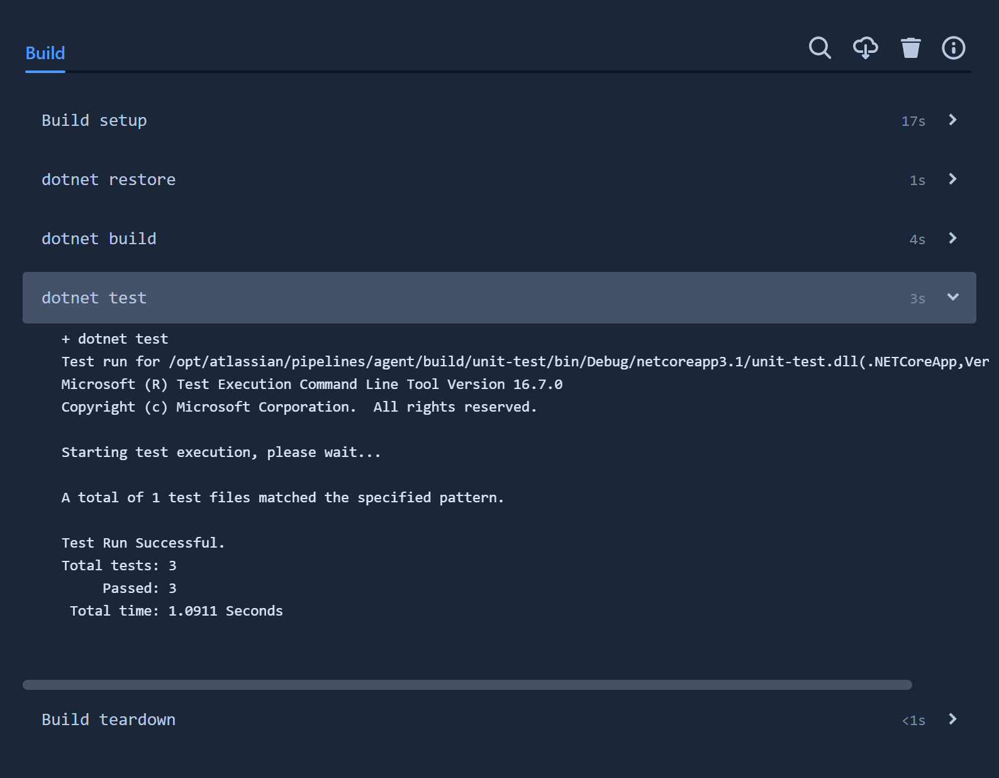

## Series
- [**Part 1: Building and testing ASP.NET Core**](/blog/bit-bucket-pipelines-part-one-building-and-testing-aspnet-core)
- [**Part 2: Deploying ASP.NET Core to Azure Web App**](/blog/bit-bucket-pipelines-part-two-deploying-aspnet-core-to-azure)
- [**Part 3: Deploying a Static Site to Azure Blob Storage**](/blog/bit-bucket-pipelines-part-three-deploying-static-site-to-azure)
- **Part 4: Advanced topics?**

## Intro

Bit Bucket pipelines is a hosted CI/CD platform that allows you to build, test, and deploy your code without managing any build servers.  All builds are done within a docker image on linux.

## Pipeline Basics

You start by creating a ```bitbucket-pipelines.yml``` file in the root of your project.  Bit bucket will help you to scaffold out this file based on the type of code in your repo.  This file has the following structure:


*Source: Atlassian*

First we have the ```image```.  This is the docker image that will be used for your build.  For .NET Core we will use ```microsoft/dotnet:sdk```.  For a javascript project we would use ```node:10.15.3```.

Next we have the ```pipelines```.  Each pipeline will consist of one or more ```step``` sections.  Each step will be run within a clean image.  By default they will use the image specified at the top of your YAML file, but you can even use different build images for different steps.  For example, you might have a repo consisting of both ASP.NET Core and React.  You could use a dotnet image for the website, and a node image for React all within the same YAML file.

The pipelines can be triggered in different ways by using ***sections***.  The simplest is to have a ```default``` section, which will trigger on every push for all branches that don't match a pipeline definition in other sections.  For more control, you might like to use a ```branches``` section to have different steps on develop vs master.  You might also like to use ```tags``` to control the flow of your pipeline.  Considering you only get a limited number of build minutes, instead of building on each commit, you might want to reduce this by only building pull requests via the ```pull-request``` section.

## Building
Let's create a website, that bit bucket will build on every commit.

First we will start by creating a repo in Bit Bucket and cloning it.



Then we will clone the repo to our machine:

```
git clone git@bitbucket.org:<your username>/aspnet-core-pipelines.git

```

Next, let's create a basic razor page web app.

```
mkdir aspnet-core-pipelines
cd aspnet-core-pipelines
dotnet new solution
dotnet new webapp --name web
dotnet sln add .\web\
```

At this stage we have a basic website that we can run:

```
cd web
dotnet run
```

Razor page website:



Push the code to Bit Bucket, and lets create our first pipeline:



Choose the .NET Core template to get us started, then we will simplify it so that we end up with the following:

```yaml
image: mcr.microsoft.com/dotnet/core/sdk:3.1

pipelines:
  default:
    - step:
        caches:
          - dotnetcore
        script:
          - dotnet restore
          - dotnet build
```

*NOTE: The default image can't build .NET Core 3.1 projects, so we need to override it to the image shown above*

And voila!  Our first successful build using pipelines!



On the right-hand side we can see the details of the build and download the logs if needed.



Our build is simple, yet effective.  As we are building from the root of the repo, we are building the whole solution.  If we had multiple projects and wanted to build one specifically we could so so via the following:

```
dotnet build ./web
```

We don't need to specify the .csproj file explicitly, as the dotnet CLI will use the first one it finds in the directory.

Because pipelines is part of bit bucket, it integrates very nicely throughout the site.  We have visibility of the build status for every commit:



And also for every branch in the repo:



Likewise, we would see something similar for any pull requests that have been raised.

## Testing
Now that we have a build running on every commit.  First lets add some tests to our solution.

```
mkdir unit-test
cd unit-test
dotnet new xunit
cd ..
dotnet sln add .\unit-test\
```

Add the following tests into your test project

```csharp
public class UnitTest1
{
    [Fact]
    public void Test1()
    {
    }

    [Fact]
    public void Test2()
    {
    }

    [Fact]
    public void Test3()
    {
    }
}
```

Check that the tests run by running the following from the repo root directory.

```
dotnet test
```

Lastly we will add our test step into pipelines.  We'll also add a name to the step so that it is more descriptive.

```yaml
image: mcr.microsoft.com/dotnet/core/sdk:3.1

pipelines:
  default:
    - step:
        name: Build and Test
        caches:
          - dotnetcore
        script:
          - dotnet restore
          - dotnet build
          - dotnet test

```

Too easy!  Now if we push our code we will see the tests being run by pipelines.



And in the details pane we can see that all 3 of our tests have passed



## Packaging
- asp.net core project
- package on push to master
- "remember, our pipeline is running on a linux docker image.  This allows us to run any linux CLI command during the build

## Deployment
- asp.net core project
- package on push to master
- optional deployment to QA
- optional deployment to Staging
- optional deployment to Prod

- cover pipes
  - Azure web app
  - Azure blob storage
  - Azure function app
  - Slack

## Advanced Pipelines
- Parallel builds
- Max build time
- use cache
- services
  - can spin up separate docker containers for things like databases
- manual triggers
- YAML anchors
  - can be used to re-use chunks of YAML configuration

## Summary

## Resources
- [Get started with Bitbucket Pipelines](https://support.atlassian.com/bitbucket-cloud/docs/get-started-with-bitbucket-pipelines/)
- [Configure bitbucket-pipelines.yml](https://support.atlassian.com/bitbucket-cloud/docs/configure-bitbucket-pipelinesyml/)
- [Use Pipelines in different software languages](https://support.atlassian.com/bitbucket-cloud/docs/use-pipelines-in-different-software-languages/)
- [Databases and Services](https://support.atlassian.com/bitbucket-cloud/docs/databases-and-service-containers/)
- [Using Caches](https://support.atlassian.com/bitbucket-cloud/docs/cache-dependencies/#Cachingdependencies-custom-caches)