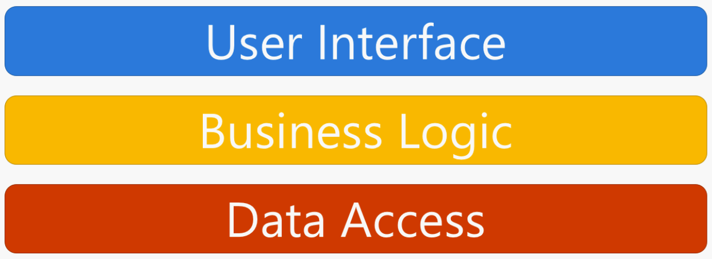
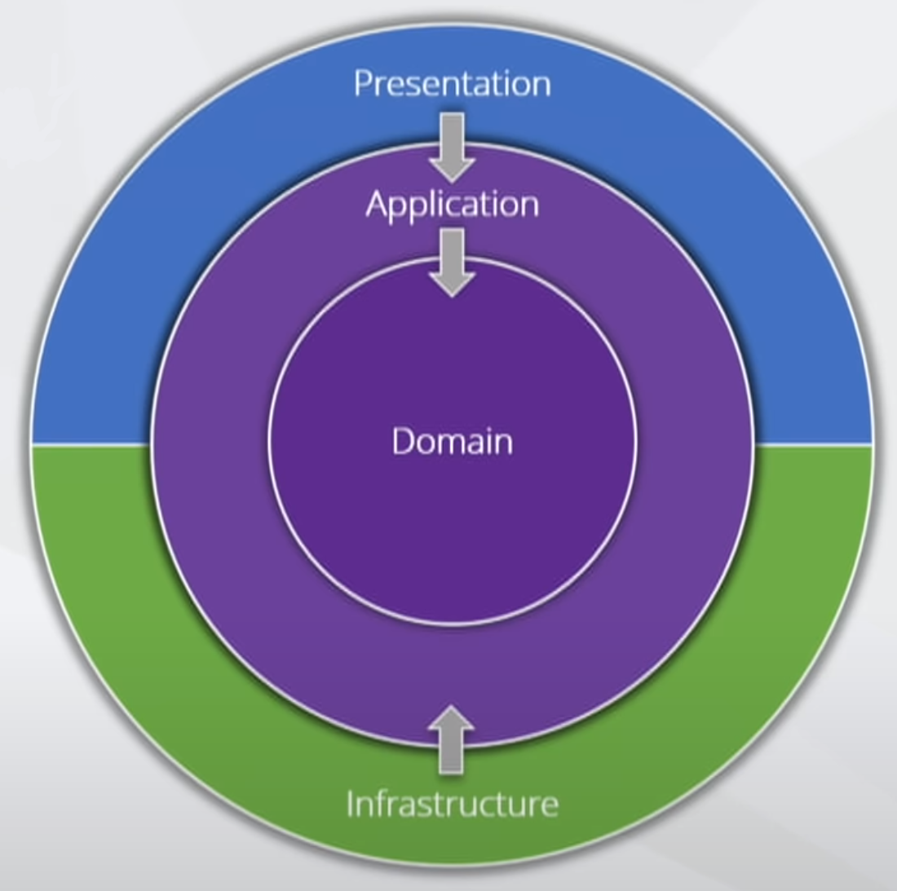
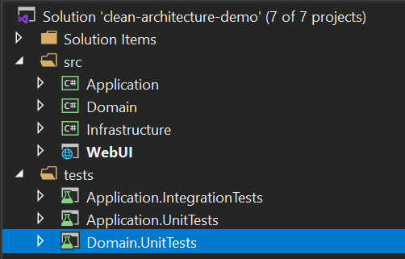

For a long time, I have been using the classic "N-Tier" architecture (UI Layer -> Logic Layer -> Data Layer) in most of the applications I build.  I rely heavily on interfaces, and learnt a long time ago that IoC (Inversion of Control) is your friend.  This architecture enabled me to build loosely coupled, testable applications, and has served me well so far. However, like many professional software engineers, I'm always on the look out as to how I can improve my architecture when designing applications.

Recently, I came across [Clean Architecture](https://youtu.be/dK4Yb6-LxAk) from a presentation by Jason Taylor at a Goto conference, and have become fascinated with this architecture / pattern.  It validated some of the things I had already been doing, but improved in other areas that always felt a bit clunky to me (like integrating with 3rd party services, and where the heck does validation go?).

*NOTE: Although this architecture is language and framework agnostic, I will be mentioning some .NET Framework terms to help illustrate concepts.*

## What is N-Tier Architecture?

First off, let's examine the classic N-Tier architecture.  This has been around for 20+ years, and it still common in the industry today.

N-Tier most commonly has 3 layers:

*Source: Microsoft Docs*

Each layer is only allowed to communicate with the next layer down (i.e UI cannot communicate directly with Data).  On the surface this limitation might seem like a good idea, but in implementation, it means a different set of models for each layer which results in way too much mapping code.  This problem gets amplified the more layers you add.

### User Interface Layer

- Controllers
- ViewModels
- DTOs
- Mappers
- Views
- Static Assets

Typically this would be an MVC or Web API project.

### Business Logic Layer

- Business / Application Logic (usually implemented as Services)
- Integration with 3rd party services
- Calls directly into the *Data layer*

This is where the meat of an N-Tier application is.

### Data Layer
- Data models
- Queries
- Database access
- Migrations

## Introducing Clean Architecture

This architecture has had many names over the years.  [Onion Architecture](http://jeffreypalermo.com/blog/the-onion-architecture-part-1/), [Hexagonal Archecture](http://alistair.cockburn.us/Hexagonal+architecture), [Screaming Architecture](http://blog.cleancoders.com/2011-09-30-Screaming-Architecture), and others.  This approach is not new, but it is also not nearly as common as it perhaps should be.

So, compared to N-Tier, what is Clean Architecture and how is it different?  

Let's start with a picture:

*Source: Clean Architecture, Jason Taylor - Goto Conference*

The first thing to notice here is the direction of the dependencies.  All dependencies flow inwards.  Outer layers can communicate with ANY inner layer (compare this to N-Tier where each layer can only communicate with the one below it).  This follows the [Dependency Inversion Principle](https://en.wikipedia.org/wiki/Dependency_inversion_principle) which means that dependencies are injected instead of being explicitly created.  Another name for this is the *Hollywood Principle: Don't call us, we'll call you*. 😊

*Application* and *Domain* are considered the 'core' of the application. *Application* depends on *Domain*, but *Domain* depends on nothing.

When the *Application* needs functionality from *Infrastructure* (e.g. database access) the *application* will define it's own interfaces that *infrastructure* will implement.  This decoupling is huge, and is one of the major benefits of this approach.  Not only does it allow for easier unit testing, it also means it is persistence ignorant.  When querying data, the underling data store could be a database, web service, or even flat file.  The application doesn't care and doesn't need to know.  With the implementation details being outside core, it allows us to focus on business logic and avoids pollution with less important details.  It also provides flexibility in that today the data might come from one data source, but in the future it may need to come from a different data source.  Due to the loose coupling, only the infrastructure layer will need to change to support this.

Jeffrey Palermo defined Four Tenants of Clean Architecture:

- The application is built around an independent object model
- Inner layers define interfaces.  Outer layers implement interfaces
- The direction of coupling is toward the center
- All application core code can be compiled and run separate from infrastructure

All of this strives to make it easy for developers to do the right things, and hard for them to do the wrong things.  We are striving to "force developers into the pit of success".

### Domain Layer

- Entities
- Value Objects
- Aggregates (if doing DDD)
- Enumerations

The *Domain Layer* is the heart of your application, and responsible for your core models.  Models should be persistence ignorant, and encapsulate logic where possible.  We want to avoid ending up with Anemic Models (i.e. models that are only collections of properties).

The *Domain Layer* could be included in the *Application Layer*, but if you are using an ORM like entity framework, the *Infrastructure Layer* will need to reference the domain models, in which case it's better to split out into a separate layer.

Data annotations should be left out of domain models.  This should be added in the *Infrastructure Layer* using fluent syntax.  If you are used to using the data annotations for you validation, I instead recommend using [Fluent Validation](https://fluentvalidation.net/) in the *Application Layer*, which provides event more capability than annotations.

### Application Layer
- Application Interfaces
- View Models / DTOs
- Mappers
- Application Exceptions
- Validation
- Logic
- Commands / Queries (if doing CQRS)

This is the *Application* of your *Domain* use to implement the use cases for your business.  This provides the mapping from your domain models to one or more view models or DTOs.  

Validation also goes into this layer.  It could be argued that Validation goes into the domain, but the risk there is that errors raised may reference fields not present in the DTO / View Model which would cause confusion.  IMO it's better to have potentially duplicated validation, than it is to validate an object that has not been passed into the command/query.

My preference is to use CQRS Commands and Queries to handle all application requests.  [MediatR](https://github.com/jbogard/MediatR/wiki) can be used to facilitate this and add additional behaviour like logging, caching, automatic validation, and performance monitoring to every request.  If you choose not to use CQRS, you can swap this out for using services instead.

The *Application Layer* ONLY references the *Domain Layer*.  It knows nothing of databases, web services, etc.  It does however define interfaces (e.g. IContactRepository, IContactWebService, IMessageBus), that are implemented by the *Infrastructure Layer*.

### Infrastructure Layer
- Database
- Web services
- Files
- Message Bus
- Logging
- Configuration

The *Infrastructure Layer* will implement interfaces from the *Application Layer* to provide functionality to access external systems.  These will be hooked up by the IoC container, usually in the *Presentation Layer*.

The *Presentation Layer* will usually have a reference to the *Infrastructure Layer*, but only to register the dependencies with the IoC container.  This can be avoided with IoC containers like Autofac with the use of Registries and assembly scanning.

### Presentation Layer
- MVC Controllers
- Web API Controllers
- Swagger / NSwag
- Authentication / Authorisation

The *Presentation Layer* is the entry point to the system from the user's point of view.  Its primary concerns are routing requests to the *Application Layer* and registering all dependencies in the IoC container.  Autofac is my favourite container, but use whatever makes you happy.  If you are using ASP.NET, actions in controllers should be very thin, and mostly will simply passing the request or command to [MediatR](https://github.com/jbogard/MediatR/wiki).

### Testing Layer
The *Testing Layer* is another entry point to the system.  Primarily this should be aiming at the *Application Layer*, which is the core of the application.  Because all infrastructure is abstracted by interfaces, mocking out these dependencies becomes trivial.

If you are interested in learning more about testing I highly recommend [Clean Testing](https://www.youtube.com/watch?v=2UJ7mAtFuio).

### Variations
The layers described so far, make up the basic approach of Clean Architecture.  You may need more layers depending on your application.

If you are not using an ORM you may be able to combine *Domain* and *Application Layers* for simplicity.

The outer-most right might also have more segments.  For example, you may wish to split out infrastructure into other projects (e.g. Persistence).

This approach works well with Domain-Driven Design, but works equally well without it.

CQRS is the recommended approach for the entry point into the *Application Layer*.  However, you could also use typical services if you're not comfortable with that.

I've also seen implementations where the application core is divided up into 4 internal layers.  IMO this is overkill for most projects.  We want to balance clarity with simplicity.

## Starter templates
This all sounds great right?  But how can I get started?

Fortunately for us all Jason Taylor has created a .NET Core Solution Template, that contains a fully functioning application with an Angular 9 Frontend, and associated unit and integration tests.  This is a great starting point to see everything in action.

You can find more about this [here](https://jasontaylor.dev/clean-architecture-getting-started/)

## Summary
Clean Architecture is by no means new, and is nothing groundbreaking.  However, with a few tweaks on the typical N-Tier architecture the result is a completely testable, more maintainable solution that can adapt to change faster.  Due to the loose coupling between outer and inner layers, modifications can be made easier, which can be the difference between an application lasting 2 years and 10 years.

I'm still working out the kinks in my own implementations, but really see the advantages with this approach and am excited to see the results over time.

Give it a try and let me know how you go.

## Resources
- [Clean Architecture - Jason Taylor](https://youtu.be/dK4Yb6-LxAk)
- [Rules to Better Clean Architecture](https://rules.ssw.com.au/rules-to-better-clean-architecture)
- [Microsoft Docs - Clean Architecture](https://docs.microsoft.com/en-us/dotnet/architecture/modern-web-apps-azure/common-web-application-architectures#clean-architecture)
- [The Clean Architecture - Robert C. Martin](https://blog.cleancoder.com/uncle-bob/2012/08/13/the-clean-architecture.html)
- [Peeling Back the Onion Architecture - Tony Sneed](https://blog.tonysneed.com/2011/10/08/peeling-back-the-onion-architecture/)
- [Onion Architecture - Jeffrey Palermo](https://jeffreypalermo.com/2008/07/the-onion-architecture-part-1/)
- [MediatR](https://github.com/jbogard/MediatR/wiki)

