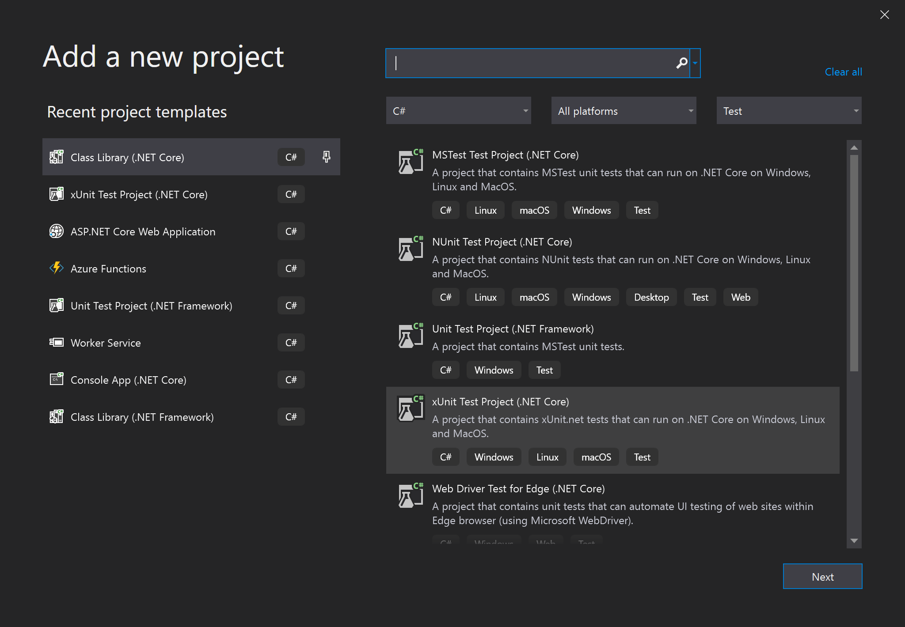
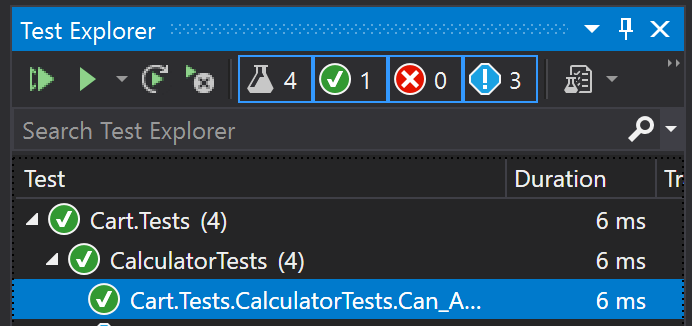

So you've written some code, and after looking at it you think to yourself *"50/50 chance this thing's gonna work..."*.  You've heard the cool kids are unit testing their code and wondering if you should follow suit? Answer: You should. 😉

## Why Unit Test?

Oftentimes, manual testing can be time consuming.  If you're site uses a database, you need to make sure the data is set up correctly, you may need to follow several steps of a flow, and afterwards reset the data so that you can test again (if needed).  All this overhead takes time.  Unit tests on the other hand, once created, provide a very quick feedback loop to test the "unit" of code you're interested in.  Over time, if you've built up a suite of tests with good coverage, running these can provide you with confidence prior to deployment.  Getting a similar level off coverage which manual testing is not always feasible or practical.  Lastly, unit tests can be quickly run by your build server for rapid feedback when a breaking change is introduced.

## Which Unit Test Framework Should I Use?
The three main contenders for .NET Core are:
1. MSTest
2. NUnit
3. xUnit

MSTest was traditionally the only test framework supported by Visual Studio, but lacks some common features.  NUnit is probably the oldest, most fully featured test framework.  xUnit is newer, but has more functionality than MSTest and is my personal favourite.  With VS2019, you can easily take your pick of any of these.



For the rest of this article, i'll be using xUnit

## xUnit Fact
Let's start with some basic unit testing, with the cannonical `Calculator` class.

```csharp
public class Calculator
{
    public int Add(int a, int b) => a + b;
}
```

Our simple `Calculator` has one method, which adds two numbers together.  Amazing.  Let's see how this can be tested.

```csharp
public class CalculatorTests
{
    [Fact]
    public void Can_Add_Two_Numbers()
    {
        // Arrange
        var a = 1;
        var b = 2;
        var sut = new Calculator();

        // Act
        var result = sut.Add(a, b);

        // Assert
        Assert.Equal(3, result);
    }
}
```

First off, you might notice that `CalculatorTests` does not need any special attributes.  It is just a regular class.  All we need is a function with a `[Fact]` attribute.  Best practice with unit tests is to divide your tests into 3 separate stages:

1. **Arrange** - this is where all your setup happens
2. **Act** - execute the code you want to test
3. **Assert** - verify your code did what you expected

*Note: SUT is short for 'Subject Under Test'.*

After running this in Visual Studio we can see our test pass.



This is a great start.  However, if we wanted to run the same test but with different parameters, we would have to duplicate the code for each test.  That is where `[Theory]` comes in.

## xUnit Theory
`[Theory]` allows us to have data driven tests.  i.e. a single test with multiple sets of inputs and outputs.  This can be done in few ways.  The simplest is with `[InlineData]` which allows you to specify the data via attributes.

```csharp
[Theory]
[InlineData(1, 2, 3)]
[InlineData(-4, -6, -10)]
[InlineData(-2, 2, 0)]
public void Can_Add_Two_Numbers_Data_Driven(int a, int b, int expectedResult)
{
    // Arrange
    var sut = new Calculator();

    // Act
    var actualResult = sut.Add(a, b);

    // Assert
    Assert.Equal(expectedResult, actualResult);
}
```

After running this test in Visual Studio we will see a separate test fo each set of data we have used.


Testt data can also be loaded from other members or classes via `[MemberData]` or `[ClassData]`.  There is a great post on this by [Andrew Lock](https://andrewlock.net/creating-parameterised-tests-in-xunit-with-inlinedata-classdata-and-memberdata/).

## Running with VS Code
But I'm running on Linux or MacOS.  How can I run these unit tests?

This can be done via the command line.  From the directory of your repo run:

```bash
dotnet test
```

Which will result in:

```bash
Microsoft (R) Test Execution Command Line Tool Version 16.3.0
Copyright (c) Microsoft Corporation.  All rights reserved.

Starting test execution, please wait...

A total of 1 test files matched the specified pattern.

Test Run Successful.
Total tests: 4
     Passed: 4
 Total time: 3.3002 Seconds
```

This command is also handy when trying to run your tests on a build server.

## Integration Tests vs Unit Tests
One distinction I would like to make is the difference between Unit Tests and Integration Tests.

Unit Tests concenrate tests on a *unit* of code.  This usually means mocking out other dependencies, to further isolote your *subject under test*.  Testing like this means your tests are fast, give you quick feedback, and can be easily run anywhere.

Integration Tests on the other hand, are like end to end tests for a peice of your code.  Any code that accesses disk, network, databases, will continue to do so during your test.  None of the dependencies are mocked out.  There are pros and cons of this approach.

**Pros**
1. Your tests have higher code coverage
2. The tests are more realistic (i.e. they are closer to how your application will actually run)
3. Your are testing code that accesses external resources (disk, networks, database)

**Cons**
1. Your tests take longer to run
2. May be difficult to run if you don't have access to the external resources (e.g. your build server)
3. A huge amount of setup can sometimes be needed to setup the data required.  

To expand on the potentially huge setup required, lets consider our cart example again.  In a real work application, where this code was hitting a real database you might have to ensure the customer existed, the orders were for real products, there was stock in the database, etc.  You also need to ensure that the tests are re-runnable.  That usually means setting up new customers, products, etc for *every* test, or re-creating the database for *every* test.  Both of these options will mean your tests are so slow they are only capable of being run by an overnight build, meaning a delay in finding broken code.  If you are not setting up your database every time, your tests will be brittle and eventually break due to data, instead of mis-functioning code.

It's probably no suprise that I prefer Unit Tests.  However, Integration Tests can have a place if you really need to test data access code, or API integration.

## Code
The code for this article can be found on [Git Hub](https://github.com/danielmackay/dotnet-core-xunit)

## Resources
- [xUnit](https://xunit.net/)

## Summary
In this article you have learned how to create unit tests with xUnit for both standard unit tests and data driven unit tests.  Not that bad right?

In Part Two - I will build on top of this with NSubstitute and Fluent Assertions to make our tests easier to write and being able to test more scenarios.


